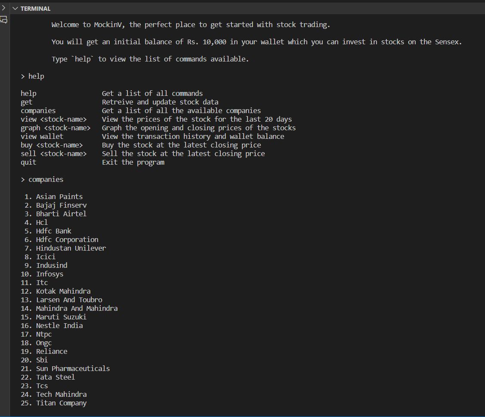
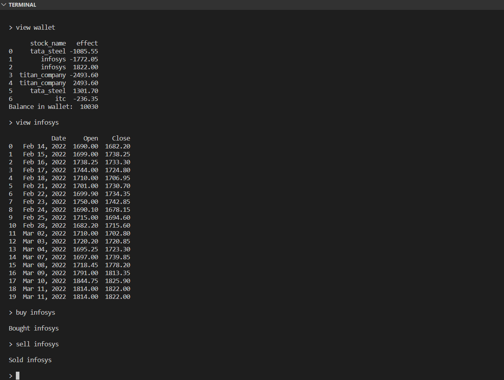
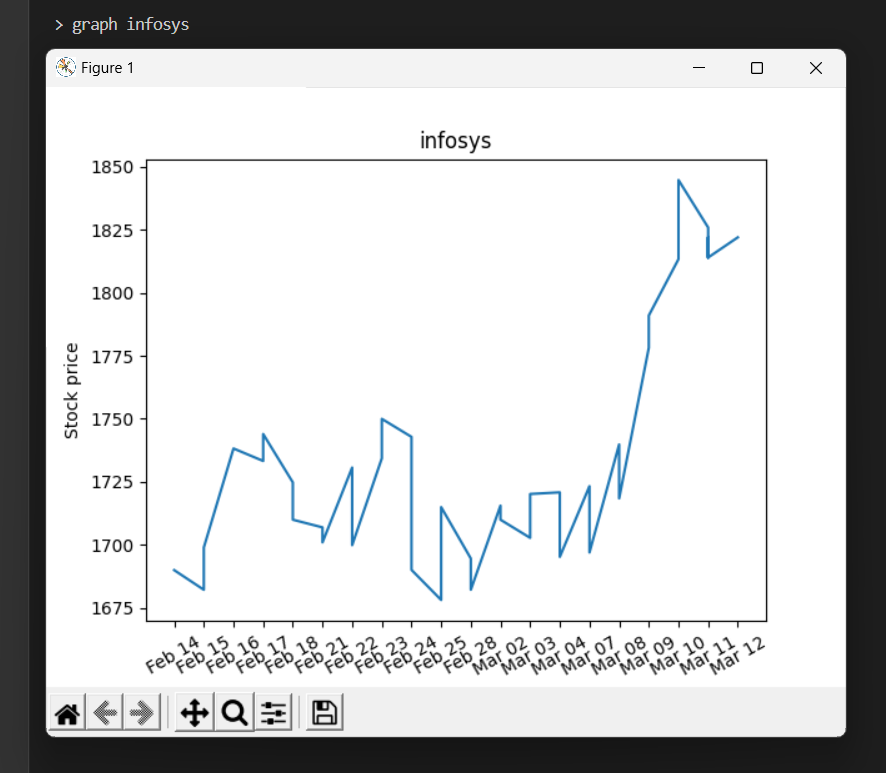

# mockinv

Class XII Informatics Practices final project - A dummy CLI based stock trading platform using Pandas, Matplotlib, and MySQL.





## Usage

- Clone the repository using the command
  
  ```
  git clone https://github.com/mihiraggarwal/mockinv.git
  ```

- Install the required libraries using the command
  
  ```
  pip install -r requirements.txt
  ```

- Create a file called `.env` and add the following
  
  ```
  DB_USER=<YOUR_MYSQL_USERNAME>
  DB_PASS=<YOUR_MYSQL_PASSWORD_BASE64_ENCODED>
  ```

- Run the python file using the command
  
  ```
  python .\main.py
  ```
